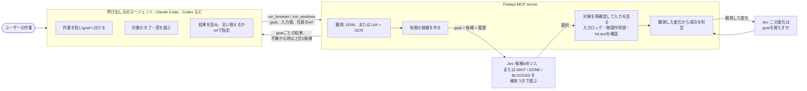
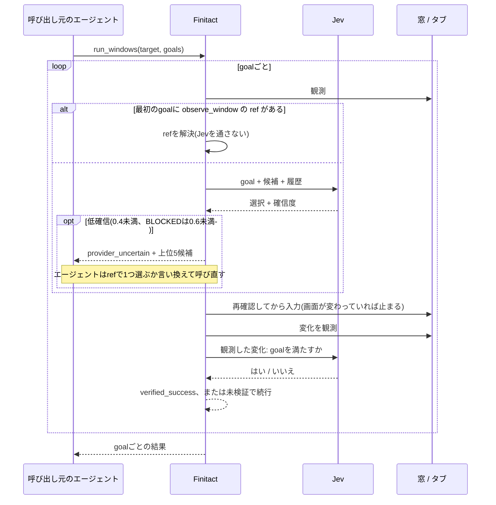

# Finitact

**Finitact**は、コーディングエージェント(Claude Code、Codex、任意のMCP client)にcomputer useをさせるMCP server。Jevなどのone decision modelを活用する。
Finitactが画面を観測して有限の候補一覧に落とし、小さな判断モデル(現在は[TypeSafeのJev](https://docs.typesafe.ai/introduction))に1つ選ばせ、入力を送り、結果を判定する。

- [English](README.md) 
- [仕様](docs/spec/specification.md) 
- [設計](docs/design.md) 
- [設計判断の一覧](docs/decisions.ja.md)([原本](docs/adr/))
- [既知の問題](docs/known-issues.ja.md)
- [評価レポート(英語)](docs/report/)

> [!NOTE]
> Finitactは[`browser-use/jev-ultrafast`](https://github.com/browser-use/jev-ultrafast)の独立した複製から始まった
> 個人プロジェクトです。Browser UseやTypeSafeの公式物ではなく、windows-mcpとも無関係です。元のMITの著作権表示は
> [LICENSE](LICENSE)に、由来は[NOTICE](NOTICE)にあります。

## 開発意図

[jev-ultrafast](https://github.com/browser-use/jev-ultrafast)と
[windows-mcp](https://github.com/CursorTouch/Windows-MCP)はどちらも優れた先行ツールだが、
率直に言ってもう一歩機能・コスパが欲しい。

- **ユースケース**: jev-ultrafastはブラウザ高速操作のデモ。これ自体は素晴らしい。
  Windowsのnativeアプリ(アクセシビリティ情報がほぼ無いBlender・Unityを含む)の操作や、  
  また個人的にイライラするウェブサイト上位のAWS Calculatorに全く歯が立たないという状況だった。
- **費用**: windows-mcpはComputer useとしては十分な機能を備えているが、トークン消費が激しい。
  短いWindows作業9件で、呼び出し元エージェントのtokenはwindows-mcpだとFinitactの2.1〜7.8倍だった([結果](#結果))。観測のたびに返る画面snapshotが文脈に残るため。

そこで、高価なエージェントは「何をするか」を短い言葉で決め、　　
安く速いモデルが「観測した操作のうちどれがそれに当たるか」を作業中に何度も決める形での実装を試行した。

## 率直な現状: エージェントにJevを制御させるのは難しい

Jevをほめそやすツイートばかり見る。
しかし正直、Jevを使うのは難しい。現時点の悩み:

- **Jevは画面の語しか知らない。** 
  Jevは選択候補の語をいわば*直感*で選ぶので、アプリ知識があればありえない選択を繰り返す。
  そのためFinitactは`provider_uncertain`で止まり、上位5件の候補を呼び出し元の
  エージェントへ返す。その往復に数秒かかります([ADR-0019](docs/adr/0019-bug-0023-label-agent.md)、
  [ADR-0020](docs/adr/0020-blocked-0-6-provider-uncertain.md)、[ADR-0022](docs/adr/0022-provider-uncertain-agent.md))。
- **`DONE`は証拠にならない。**
  各進度が現状は信頼ならない。成功は、観測した画面変化に対する規則と、その変化がgoalを満たすかのJevの判断を組み合わせて決めます。判定は保守的で、学習に使っていない標本では実際の成功の44〜56%しか成功と確認できず、1行文書を置き換える入力は一度も成功と確認しません。外れても誤った成功ではなく「未検証」になります([ADR-0030](docs/adr/0030-finitact-jev.md))。
- **安全の保証はモデルへ渡せない。** 領域が入力欄か、popupが一時表示かの判断は75〜82%しか当たらなかった。
  候補が実行可能であることは、観測した根拠か入力直前の確認でFinitactが保証し、Jevは実行可能な候補から選ぶだけ。
- **エージェントは用意した使い方をしてくれない。** 呼び出し元のエージェントは候補を直接指定する最初の2つの方法を使わないか、取り違えました。
  tool説明の文言を調整する代わりに、指定方法をgoalの1欄(`ref`)にまとめました
  ([ADR-0041](docs/adr/0041-observe-window-ref-pick.md)〜[ADR-0043](docs/adr/0043-jev-goal-ref.md))。
- **判断の品質は今後に期待。** 固定した13の判断case×10回で、期待どおりの選択はJevが89.2%
　　ちなみにローカルのQwen2.5-14Bが84.6%で、どちらも事前に決めた90%に届かず、失敗の形も異なった。Laya 0.3.21は53.8%とさらに低い。
  ([判断モデルの比較](docs/report/jev.md))。

尚、Jevを誘導するのに、いわゆるprompt engineeringをAgent自身にさせることは避けたかった、が、一部やらせてしまっている。

## 役割分担

| 役割 | 決めること | しないこと |
|---|---|---|
| 呼び出し元のエージェント | goalの中身、対象の窓・タブ、入力する正確な文字、失敗後の次の手 | 途中の画面をすべて見る(`observe_*`で求めた時だけ見る) |
| Finitact | 何が観測でき実行できるか、いつ止まるか、入力してよいか、goalを達成したか | selectorや座標を作る、届いたか不確かな入力を再送する |
| Jev | goalに合う観測済み候補はどれか、観測した変化がgoalに合うか | 座標・selector・文字列を作る、安全を保証する |

ブラウザのgoalで文字が要り、エージェントが`fill_values`を渡さなかった時だけ、小さなtext modelが値を書きます。

## 1回のrunの流れ

## runが失敗した時

Finitactに自動のfallbackは無い。入力を自分で再送せず、経路も自分で切り替えない。
結果は止まった理由を返し、どう立て直すかは呼び出し元のエージェントが決める。

| 結果に出るもの | エージェントが取れる手 |
|---|---|
| `termination_reason: provider_uncertain` | `screen_candidates`の1つをgoalの`ref`で指定するか、goalを言い換えて呼び直す([ADR-0022](docs/adr/0022-provider-uncertain-agent.md)、[ADR-0043](docs/adr/0043-jev-goal-ref.md))。 |
| `outcome: unverified` | 続ける前に`screen_changes`・`observe_window`・`observe_browser`で状態を確かめる。 |
| `final_state.out_of_reach`と`screen_target` | `screen_target`に対して`run_windows`を呼ぶ([ADR-0048](docs/adr/0048-browser-boundary-screen-handoff.md))。 |
| `status: partial`または`stopped`と`remaining_goal_ids` | 残ったgoalだけで新しいrunを送る。 |
| `termination_reason: budget`または`deadline` | 予算を増やすか期限を延ばして呼び直す。 |
| 応答が返らない | 同じ`run_id`・同じ入力で呼び直す。保存済みの結果が返り、入力は繰り返さない。 |
| `mutation_state: uncertain` | 人間か独立した確認で状態が分かるまで、新しい`run_id`で再試行しない。 |

`get_run_journal`はrunの記録を返し、`cancel_run`はrunを止める。Finitactは別のcomputer use手段を同梱しない。
Finitactでできない作業は、エージェントが自分の道具(shellや別のMCP serverなど)で行う。

## 結果

2026-10-04計測。呼び出し元はClaude Code・`claude-sonnet-5-5`、Finitactは単一commit、promptは両系同一。
条件と限界は[docs/report/](docs/report/)(英語)。

- 短いWindows作業9件(メモ帳、電卓、VS Code、Tk、Unity、Blender)を各10回実行した。windows-mcpは全件10/10、
  Finitactは8件10/10・1件9/10(Blenderでmenuが開いたまま終了)。Finitactは9件中7件で速く、呼び出し元のエージェントのtokenは全9件で1/1.4〜1/6.5。
- 多段作業5件を各5回: Finitactは全件5/5。windows-mcpは4件5/5、Wikipedia検索4/5(検索経路を示せず)。tokenは4件で
  少なく(1/1.4〜1/2.6)、1件で多い(1.4倍)。
- FinitactがJevへ払うtokenはこの数に含まない。Jev分も定価で合算した1試行の費用は14件中13件でFinitactが安く
  (短い作業1/1.3〜1/6.3、多段1/1.4〜1/1.9)、Wikipedia検索では1.1倍高い(レポート参照)。

## 導入

必要なもの: Python 3.12+とuv、TypeSafe API key(`TYPESAFE_API_KEY`、全run)、OpenAI互換text modelのkey
(`TEXT_MODEL_API_KEY`、`fill_values`無しの入力goalだけ)、`run_browser`はCDP接続したChrome、`run_windows`は
Windows 10/11 x64のWindows-native Pythonと`screen` extra(OCRはpipで入るRapidOCR。Tesseract等の別途導入は不要)。
keyは`.env.example`を`.env`へ複製して書く。serverは起動時にcheckoutの`.env`を読む  
セットアップ手順・tool一覧・安全機構と制約は[英語版](README.md#setup)を参照のこと  
ブラウザ操作の前提条件(CDP接続したChrome、`run_windows`をブラウザ経路へ回す条件)は[英語版](README.md#prerequisites-for-browser-operation)に明記  
設計記録(`docs/adr/`)と仕様は日本語、評価レポートは英語
