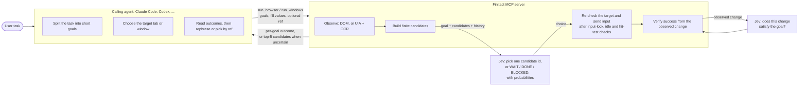
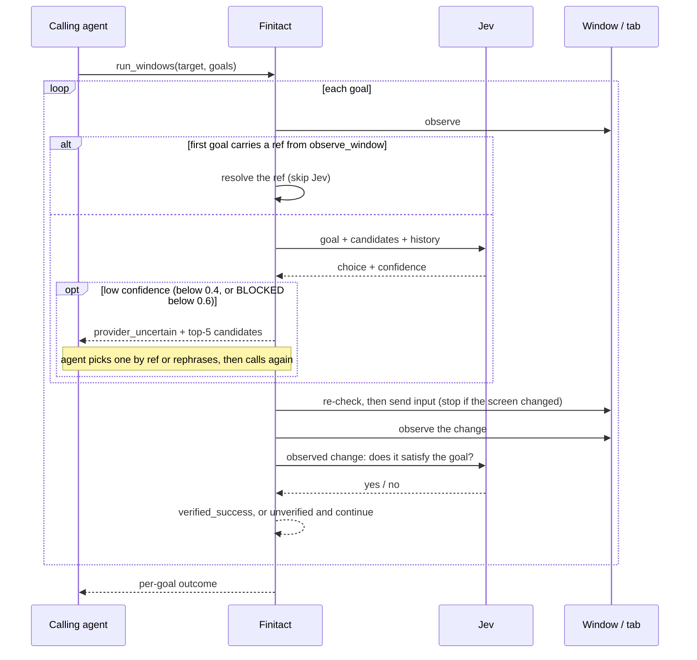

# Finitact

**Finitact** is an MCP server that lets coding agents (Claude Code, Codex, any MCP client) do computer use by
leaning on a one-decision model such as Jev.
Finitact observes the screen, reduces it to a finite list of candidates, has a small decision model (currently
[TypeSafe's Jev](https://docs.typesafe.ai/introduction)) pick one, sends the input, and judges the result.

- [日本語](README.ja.md)
- [Specification](docs/spec/specification.md)
- [Design](docs/design.md)
- [Design decisions](docs/decisions.md) ([records](docs/adr/))
- [Known issues](docs/known-issues.md)
- [Evaluation report](docs/report/)

> [!NOTE]
> Finitact started as an independently maintained copy of
> [`browser-use/jev-ultrafast`](https://github.com/browser-use/jev-ultrafast). It is a personal project, not an
> official release of Browser Use or TypeSafe, and it is not affiliated with windows-mcp. The original MIT
> copyright stays in [LICENSE](LICENSE). [NOTICE](NOTICE) records the provenance.

## Intent

[jev-ultrafast](https://github.com/browser-use/jev-ultrafast) and
[windows-mcp](https://github.com/CursorTouch/Windows-MCP) are both excellent prior work, but honestly I wanted a
bit more capability and cost-efficiency.

- **Use cases.** jev-ultrafast is a fast browser-driving demo, and a great one. But it could not touch native Windows
  apps (including Blender and Unity, which expose almost no accessibility information), and it got nowhere on the
  AWS Pricing Calculator, one of the websites that annoys me most.
- **Cost.** windows-mcp has everything computer use needs, but it burns tokens. On nine short Windows tasks the
  calling agent used 1.4× to 6.5× more tokens with windows-mcp than with Finitact ([results](#results)), because every
  observation returns a desktop snapshot that stays in its context.

So I tried an implementation where the expensive agent decides *what* to do in a few words, and a cheap, fast model
decides *which of the observed controls* that means, many times per task.

## Honest status: Jev is hard to use

My feed is full of posts praising Jev. Honestly, though, Jev is hard to use. Current pain points:

- **Jev only knows the words on the screen.**
  Jev picks among candidate words on something like *intuition*, so it keeps making choices that anyone with
  knowledge of the app would rule out. Finitact therefore stops with `provider_uncertain` and hands the top five
  candidates back to the calling agent, which costs a round trip of several seconds
  ([ADR-0019](docs/adr/0019-bug-0023-label-agent.md), [ADR-0020](docs/adr/0020-blocked-0-6-provider-uncertain.md),
  [ADR-0022](docs/adr/0022-provider-uncertain-agent.md)).
- **`DONE` is not proof.**
  Its progress signals cannot be trusted yet. Finitact decides success with a rule over the observed screen change,
  combined with Jev's judgment of whether that change satisfies the goal. The judgment is conservative: on held-out samples it
  confirmed only 44–56% of real successes, and it never confirms a fill that replaces a one-line document. A miss
  becomes "unverified", not a false success ([ADR-0030](docs/adr/0030-finitact-jev.md)).
- **Safety cannot be delegated to the model.** Jev judged correctly only 75–82% of the time whether a region is an
  input field, or whether a popup is transient. Finitact guarantees that a candidate is executable from observed
  evidence or checks just before input. Jev only chooses among executable candidates.
- **Agents do not use the interface you design for them.** Calling agents ignored or confused the first two ways to
  pick a candidate directly. Instead of tuning tool descriptions, I collapsed them into one field on the goal (`ref`)
  ([ADR-0041](docs/adr/0041-observe-window-ref-pick.md)–[ADR-0043](docs/adr/0043-jev-goal-ref.md)).
- **Decision quality: hoping for more.** On a fixed set of 13 decision cases × 10 repetitions, Jev chose the expected
  action 89.2% of the time.
  For reference, a local Qwen2.5-14B scored 84.6%. Neither reached the preregistered 90% bar, and their failures took
  different shapes. Laya 0.3.21 scored lower still, at 53.8% ([decision-model comparison](docs/report/jev.md)).

I wanted to avoid having the agent itself do so-called prompt engineering to steer Jev, but in places it ended up
doing some.

## How the work is split



| Role | Decides | Never does |
|---|---|---|
| Calling agent | What the goals are, which window or tab, the exact text to enter, what to do after a failure | See every intermediate screen (unless it asks with `observe_*`) |
| Finitact | What is observable and executable, when to stop, whether input may be sent, whether the goal was reached | Invent selectors or coordinates, or resend input whose delivery is uncertain |
| Jev | Which observed candidate matches the goal, and whether an observed change fits the goal | Produce coordinates, selectors, or text, or guarantee safety |

A small text model writes a value only when a browser goal needs text and the agent did not supply `fill_values`.

## One run, step by step



## Results

Measured on 2026-10-04 with Claude Code and `claude-sonnet-5-5` as the calling agent, one Finitact commit, and the
same prompt for both systems. Details and limits are in [docs/report/](docs/report/).

- 9 short Windows tasks (Notepad, Calculator, VS Code, Tk, Unity, Blender), 10 trials each: windows-mcp succeeded 10/10
  on every task, Finitact 10/10 on 8 and 9/10 on one (Blender, a menu left open). Finitact was faster on 7 of 9, and
  the calling agent used 1.4× to 6.5× fewer tokens with it on all 9.
- 5 multi-step tasks, 5 trials each: Finitact succeeded 5/5 on all. windows-mcp succeeded 5/5 on four and 4/5 on the
  Wikipedia task (the search route could not be shown). The calling agent used fewer tokens with Finitact on four
  (1.4× to 2.6×) and more on one (1.4×).
- Finitact's own calls to Jev are not in these token counts. Counting them at list prices, a trial still cost less
  with Finitact on 13 of 14 tasks (1.3× to 6.3× short, 1.4× to 1.9× multi-step) and 1.1× more on the Wikipedia task
  (see the report).

## Setup

### Requirements

| What | Needed for | Notes |
|---|---|---|
| Python 3.12+ and [uv](https://docs.astral.sh/uv/) | everything | |
| TypeSafe API key (`TYPESAFE_API_KEY`) | every run | Jev chooses each action. Get a key from [TypeSafe](https://docs.typesafe.ai) |
| OpenAI-compatible text model key (`TEXT_MODEL_API_KEY`) | fill goals without `fill_values` | Composes the text to type. The default endpoint is OpenRouter (`.env.example`) |
| Chrome started with `--remote-debugging-port` | `run_browser` | See [Prerequisites for browser operation](#prerequisites-for-browser-operation) |
| Windows 10/11 x64, Windows-native Python 3.12 with the `screen` extra | `run_windows` | OCR is RapidOCR (ONNX Runtime / OpenVINO), installed by pip. RapidOCR downloads its models once. You do not need Tesseract or other system OCR. UI Automation uses `comtypes` |

The server reads the checkout's `.env` at start-up (variables set by the MCP client take precedence), so the keys
do not have to be passed through the client configuration.

```bash
git clone https://github.com/yo-xe/finitact.git
cd finitact
uv sync
cp .env.example .env   # set TYPESAFE_API_KEY (and TEXT_MODEL_API_KEY for generated text)
```

### Browser

Start Chrome with remote debugging (we recommend a disposable profile), then register the server with your MCP
client:

```bash
claude mcp add finitact -- uv --directory /path/to/finitact run finitact-mcp
```

Set `BU_CDP_URL=http://127.0.0.1:9222` if Chrome listens on a non-default endpoint.

#### Prerequisites for browser operation

`run_browser` needs a Chrome reachable over CDP: started with `--remote-debugging-port` (default `9222`, otherwise
`BU_CDP_URL`). `run_windows` hands a goal on a Chrome window to the browser path only when all of these conditions hold.
Otherwise it stays on screen input:

- enabled by `routing: "browser_if_singleton"` on the call, or by `FINITACT_WINDOW_BROWSER_ROUTE=1` for calls that omit `routing`.
- `BU_CDP_URL` is a local `http` endpoint (`127.0.0.1`, `localhost`, `::1`) and `BU_CDP_WS` is unset.
- the CDP browser process owns exactly one visible, non-minimized window, the target, and that window has exactly
  one tab. Finitact ignores the browser's own bubbles, such as the download bubble.
- the tab's title prefixes the window title, its page is `http(s)` and visible, and the window does not change while Finitact checks this.
- the call has one goal and no `ref`, drop target, operation limits, label constraints or selection policies.

An everyday Chrome with several tabs therefore stays on screen input. Use a dedicated profile with a single tab.

### Windows

Only Windows-native Python sends mouse and keyboard input. Install into a Windows venv (x64) with the screen extra and
download the OCR models once:

```powershell
py -3.12 -m venv .venv; .venv\Scripts\python.exe -m pip install -e ".[screen]"
.venv\Scripts\python.exe -c "from finitact.stage1_extractors import default_ocr_extractor; default_ocr_extractor()"
```

Register that interpreter with a Windows MCP client:

```powershell
claude mcp add finitact -- C:\path\to\finitact\.venv\Scripts\python.exe -m finitact.mcp_server
```

From a client running in WSL, set `FINITACT_WINDOWS_PYTHON` in `.env` to that `python.exe` and register
[`scripts/finitact-mcp-windows.sh`](scripts/finitact-mcp-windows.sh). The script forwards the keys through `WSLENV`.

### Tools

| Tool | Purpose |
|---|---|
| `list_windows` | Targets as `window:<HWND>:<PID>` |
| `observe_window` / `observe_browser` | Read-only candidates with `ref`s |
| `run_windows` / `run_browser` | Execute ordered goals and return the per-goal `outcome` |
| `get_run_journal` / `cancel_run` | Inspect or stop a run |

Treat `confirmed` as "input was sent", not "goal succeeded". Read `outcome`. Replaying the same `run_id` with the
same input returns the cached result without repeating input.

## Safety and limits

- Mouse and keyboard input starts only after one second without user input and while an on-screen indicator is visible. Each run is
  bounded by a deadline, an action budget and a budget of decision-model calls. Ending the server process stops a run.
- Input is never resent automatically. If it is unclear whether input arrived, the server refuses further input
  until it restarts.
- Screen `fill` replaces the clipboard and does not restore it.
- Tested on the cases in the report only. Electron menus through UIA, long tasks across many windows, and other
  operating systems are untested.

## Development

```bash
uv run ruff check .
uv run pytest        # offline
uv build
```

Live evaluation scripts under `scripts/` drive real windows and make paid API calls.

Design records (`docs/adr/`, `docs/bugs/`) and the specification are in Japanese. This README, the evaluation report,
[decisions.md](docs/decisions.md) and [known-issues.md](docs/known-issues.md) are
in English.

---

[jev-ultrafast](https://github.com/browser-use/jev-ultrafast) · [windows-mcp](https://github.com/CursorTouch/Windows-MCP) ·
[TypeSafe](https://docs.typesafe.ai/) · [Browser Harness](https://github.com/browser-use/browser-harness)
